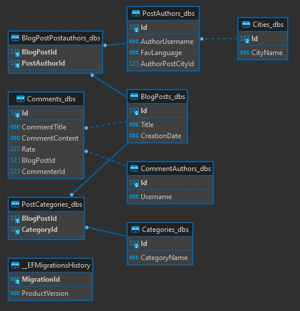
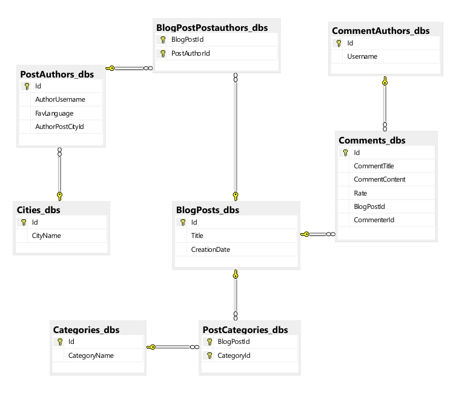

# csharp-blogpost
post of a blog, data model in csharp .net


## ER Model

~~~mermaid
erDiagram
    POST ||--o{ PostComment : places
    PostComment ||--o{ COMMENTER : places
    POST ||--o{ PostAuthor : places
    PostAuthor ||--o{ AUTHOR : places
    AUTHOR ||--o{ CITY : places
    POST ||--o{ PostCategory : places
    PostCategory ||--o{ Category : places
~~~


### Schema from Dbeaver



### Schema from MS SQL Server




## Misc

- ef core [dotnet add package Microsoft.EntityFrameworkCore --version 7.0.3]
- ef design [dotnet add package Microsoft.EntityFrameworkCore.Design --version 7.0.3]
- ef sqlite [dotnet add package Microsoft.EntityFrameworkCore.Sqlite --version 7.0.3]
    - [https://www.nuget.org/packages/Microsoft.EntityFrameworkCore.Sqlite/7.0.3]
- ef SQL Server [dotnet add package Microsoft.EntityFrameworkCore.SqlServer --version 7.0.3]
- DTO documentation
    - [https://learn.microsoft.com/en-us/aspnet/web-api/overview/data/using-web-api-with-entity-framework/part-5]
- AutoMapper Libs:
    - [https://www.nuget.org/packages/AutoMapper]
    - [https://www.nuget.org/packages/AutoMapper.Extensions.Microsoft.DependencyInjection]

### Commands EF

- `dotnet ef migrations add InitialCreate1`
- `dotnet ef database update`
- Install the right version
    - install (go)[https://www.nuget.org/packages/dotnet-ef/7.0.0]
        - `dotnet tool install --global dotnet-ef --version 7.0.0`
    - [https://learn.microsoft.com/en-us/dotnet/core/tools/dotnet-tool-uninstall]
        - `dotnet tool uninstall <PACKAGE_NAME> -g|--global`

- Conneiction String Examples:
    ```
    "conn1": "Data Source=RYZ\\SQLEXPRESS_SS;Initial Catalog=TestDb;User ID=ss;Password=passw0rd;Trust Server Certificate=True",
    "conn2": "Data Source=RYZ\\SQLEXPRESS_SS;Initial Catalog=TestDb;Persist Security Info=True;User ID=ss;Password=passw0rd;Encrypt=False;Trust Server Certificate=True"
    ```
- Connection String from VS:
    - SQL Server Object Exp;lorer > Advance > Connection String
    - Can also "test" the connection


